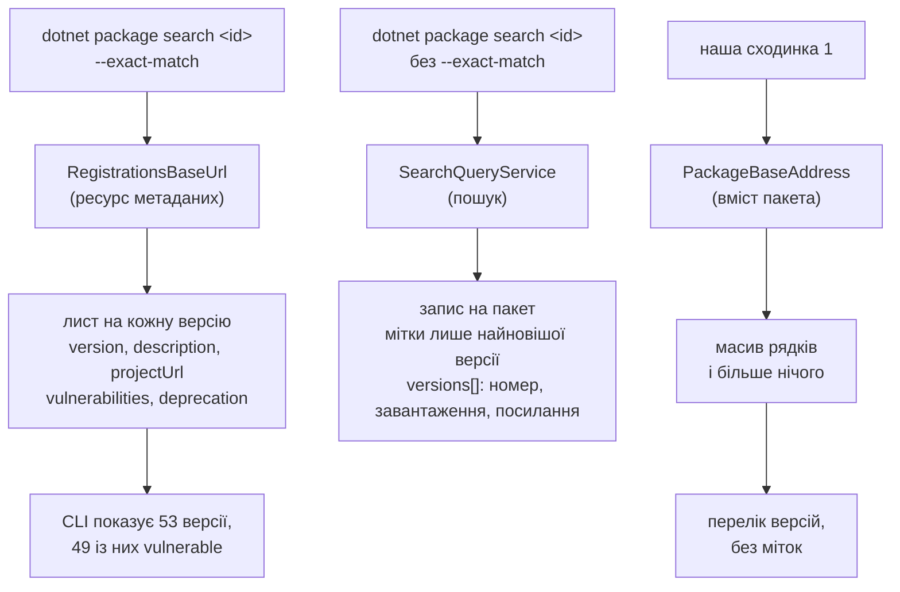

# HTTP-ендпоінти NuGet: що доступно, що з цього можна викликати і де лежать дані

Робочий документ до [#27](https://github.com/averenium/Ave-Nuget-Manager/issues/27). Усе нижче **виміряно**, а не взято з документації: nuget.org, лабораторний Nexus (`docker/nexus`: proxy, group, hosted), BaGet і BaGetter у Docker, MyGet, Azure Artifacts, GitHub Packages, Telerik.

---

## 1. Точка входу: service index

Єдина адреса, яку задає користувач у `nuget.config`. Усе інше береться з неї.

```
GET {source url}            → { "version": "3.0.0", "resources": [ { "@id", "@type", "comment" } ] }
```

### Що рекламують реальні фіди

| Фід | Ресурсів / типів | `RegistrationsBaseUrl` | `SearchQueryService` | `VulnerabilityInfo` | `Catalog` |
|---|---|---|---|---|---|
| nuget.org | 40 / 17 | *(без версії)*, 3.0.0-beta, 3.0.0-rc, 3.4.0, 3.6.0, Versioned | *(без версії)*, beta, rc, **3.5.0** | 6.7.0 | 3.0.0 |
| Nexus proxy | ~29 | ті самі шість | + 3.5.0 | 6.7.0 → **api.nuget.org** | → **api.nuget.org** |
| Nexus group | 10 | ті самі шість | beta, rc | немає | немає |
| Nexus hosted | 10 | 3.4.0, 3.6.0, Versioned | beta, rc | немає | немає |
| MyGet | 24 / 10 | ті самі шість | beta, rc | немає | немає |
| Azure Artifacts | 11 / 9 | **beta, 3.6.0, Versioned** | **beta** | немає | немає |
| BaGet / BaGetter | 12 / 6 | ***(без версії)*, beta, rc** | *(без версії)*, beta, rc | немає | немає |
| GitHub Packages | — | **401 на самому індексі** | — | — | — |
| Telerik | — | **401** | — | — | — |

### Правила, що випливають

**Ніколи не шукати точний рядок `@type`.** В Azure Artifacts немає безверсійного `RegistrationsBaseUrl`, у BaGet немає `3.6.0`. Шукати за базовим типом до `/`, далі обирати серед суфіксів.

**Суфікси означають конкретні речі — вони описані в специфікації, гадати не треба.** Див. таблиці нижче. Але реалізація може їх не дотримуватись: BaGet рекламує лише SemVer1-ові суфікси й при цьому віддає SemVer2-версії. Тобто обирати треба **за специфікацією**, а покладатись — на те, що реально прийшло у відповіді.

**Спуск по суфіксах мусить перестрибувати діри:** в Azure є `3.6.0`, але немає `3.4.0`.

**Кілька `@id` під одним `@type` — це failover, а не дублі.** nuget.org публікує `SearchQueryService` двічі на кожну версію (`azuresearch-usnc` і `azuresearch-ussc`).

**Індекс проксі змішує свої й чужі хости.** Через `nuget.org-proxy`: registration, flat container і search переписані на Nexus, а `Catalog`, `VulnerabilityInfo`, `SearchAutocompleteService`, `ReadmeUriTemplate` лишились на `api.nuget.org` / `azuresearch-usnc.nuget.org`. Тобто `@id` із корпоративного фіда може вести назовні.

**401 на індексі — це стан, а не поломка.** GitHub Packages віддає його навіть для публічної організації.

**Невідомі `@type` ігнорувати.** Azure Artifacts несе `VssBaseUrl`, `VssFeedId`, `AzureDevOpsProjectId`. Специфікація це прямо вимагає: *«All properties that the implementation does not understand should be ignored»*.

### Канонічний перелік `@type` — за специфікацією

Джерело: [Overview of the NuGet Server API](https://learn.microsoft.com/en-us/nuget/api/overview), [Package Metadata](https://learn.microsoft.com/en-us/nuget/api/registration-base-url-resource), [Search](https://learn.microsoft.com/en-us/nuget/api/search-query-service-resource).

**Ресурси і чи вони обовʼязкові:**

| Ресурс | Обовʼязковий | Призначення |
|---|---|---|
| `PackageBaseAddress` | **так** | вміст пакета (.nupkg) |
| `RegistrationsBaseUrl` | **так** | метадані пакета |
| `SearchQueryService` | **так** | пошук за ключовими словами |
| `PackagePublish` | **так** | push і delete/unlist |
| `SearchAutocompleteService` | ні | пошук id і версій за підрядком |
| `VulnerabilityInfo` | ні | пакети з відомими вразливостями |
| `Catalog` | ні | повний журнал подій фіда |
| `ReportAbuseUriTemplate`, `PackageDetailsUriTemplate`, `OwnerDetailsUriTemplate`, `ReadmeUriTemplate` | ні | побудова URL на веб-сторінки |
| `RepositorySignatures` | ні | сертифікати підпису |
| `SymbolPackagePublish` | ні | push символів |

**`RegistrationsBaseUrl` — пʼять рядків, три різні гілки даних:**

| `@type` | Що означає |
|---|---|
| `RegistrationsBaseUrl` | початковий випуск; **без стиснення**, SemVer 2.0.0 **виключено** |
| `RegistrationsBaseUrl/3.0.0-beta` | синонім попереднього |
| `RegistrationsBaseUrl/3.0.0-rc` | синонім попереднього |
| `RegistrationsBaseUrl/3.4.0` | `Content-Encoding: gzip`, SemVer 2.0.0 **виключено** |
| `RegistrationsBaseUrl/3.6.0` | gzip, SemVer 2.0.0 **включено** |

Тобто вибір суфікса змінює **склад пакетів у відповіді**, а не лише стиснення: на 3.4.0 і нижче SemVer2-пакети просто відсутні, і клієнт не відрізнить це від «такої версії немає». Тому цільовий суфікс — `3.6.0`.

**`RegistrationsBaseUrl/Versioned`, який рекламує nuget.org, у специфікації відсутній** — ще один привід не валідувати набір типів, а вибирати з нього.

**`SearchQueryService` — чотири рядки:**

| `@type` | Що означає |
|---|---|
| `SearchQueryService` | початковий випуск |
| `SearchQueryService/3.0.0-beta` | синонім |
| `SearchQueryService/3.0.0-rc` | синонім |
| `SearchQueryService/3.5.0` | додає параметр `packageType` і поле `packageTypes`; **повністю зворотно сумісний** |

Оскільки 3.5.0 лише додає, його відсутність у MyGet і Azure коштує рівно фільтра за типом пакета — не пошуку загалом.

**`SearchAutocompleteService`**: специфікація прямо каже, що коли джерело його не реалізує, автодоповнення треба **вимикати мʼяко**, а не вважати фід зламаним.

**Недокументовані ресурси**, на які спеціально не варто спиратись: `SearchGalleryQueryService`, `PackageDisplayMetadataUriTemplate`, `PackageVersionDisplayMetadataUriTemplate`, `LegacyGallery`.

**Транспорт:** будь-який `GET` може віддати 301/302 — редиректи слід виконувати; офіційний клієнт робить **три спроби** на будь-який 5xx або помилку TCP/DNS.

---

## 2. `PackageBaseAddress/3.0.0` — flat container

Єдиний ресурс, який був **у всіх** фідів, що відповіли, і рівно в одній версії. Тому перша сходинка драбини.

```
GET {base}/{id-lower}/index.json                       → { "versions": [ "1.0.0", … ] }
GET {base}/{id-lower}/{ver-lower}/{id-lower}.nuspec    → XML nuspec
GET {base}/{id-lower}/{ver-lower}/{id-lower}.{ver}.nupkg → сам пакет
```

**Що дає:** список версій; повний nuspec будь-якої версії — з `authors`, `description`, `projectUrl`, `<license>`, `tags`, `<repository url commit>`, `<dependencies>` з групами по TFM і діапазонами, `<frameworkAssemblies>`.

**Чого не дає:** `published`, `deprecation`, `vulnerabilities`, лічильники завантажень — це серверні властивості, у пакеті їх немає.

**Ціна:** `newtonsoft.json` 13.0.4 — nuspec **2.4 КБ**, nupkg **2.4 МБ**. Тисячократна різниця; nupkg качати не треба ніколи, якщо потрібні метадані.

**Пастка:** flat container **нормалізує метадані збірки**. Та сама версія: тут `2.0.0-alpha.1`, у реєстрації `2.0.0-alpha.1+build.7`.

---

## 3. `RegistrationsBaseUrl` — реєстрація

```
GET {base}/{id-lower}/index.json
  → { "count": n, "items": [ { "@id", "lower", "upper", "count", "items"? } ] }
      items[].items[] = { "@id", "catalogEntry": { … }, "packageContent" }
```

**Передбачуваний лише індекс.** Специфікація гарантує форму `{base}/{LOWER_ID}/index.json` (id у нижньому регістрі за правилами `ToLowerInvariant`), а адреси сторінок і листів **навмисно непередбачувані** — їх треба брати з `@id` у документі. Те, що на nuget.org лист лежить за `{id}/{version}.json`, документація називає збігом і прямо попереджає на це не спиратись.

`lower`/`upper` на сторінці **обовʼязкові за специфікацією** — тож потрібну сторінку можна вибрати, не завантажуючи решту. Це підтвердилось на всіх шести перевірених реалізаціях.

**Версії в `lower`/`upper` нормалізовані й без метаданих збірки**, а `catalogEntry.version` — повний рядок, який метадані збірки містити може. Саме звідси розбіжність із flat container, і це задокументована поведінка, а не примха сервера.

**Правило пагінації nuget.org:** 128 і більше версій — сторінки по 64 без інлайну; менше 128 — усе інлайном. Звідси `EasyNetQ` з 11 сторінками і `Microsoft.AspNetCore.OpenApi` одним документом.

**Інлайнінг — властивість пакета, не фіда.** `Microsoft.AspNetCore.OpenApi` віддає всі 126 версій одним запитом; `EasyNetQ` має 11 сторінок і не інлайнить жодної. Той самий nuget.org відповідає обома способами.

### Поля `catalogEntry` і де вони є

| Поле | nuget.org | Nexus | BaGet | MyGet / Azure | Що з нього робимо |
|---|---|---|---|---|---|
| `version`, `id` | + | + | + | + | список версій |
| `authors`, `description`, `summary`, `tags`, `title` | + | + | + | + | панель Info |
| `projectUrl`, `iconUrl` | + | + | + | + | посилання, іконка |
| `licenseUrl` | + | + | + | + | ліцензія (запасний шлях) |
| `licenseExpression` | + | + | **немає** | + | ліцензія (#89) |
| `published`, `listed` | + | + | + | + | дата публікації |
| `dependencyGroups[].targetFramework` | + | + | + | + | сумісність з TFM (#107) |
| `dependencyGroups[].dependencies[].range` | + | + | + | + | каскад залежних (#109) |
| `readmeUrl` | + | немає | немає | ? | не використовуємо |
| `deprecation` | + | **немає** | немає | не перевірено | мітка «закинутий» + пакет-заміна |
| `vulnerabilities` | + | **немає** | немає | не перевірено | мітка вразливості на версії |
| `packageContent` | + | немає | + | + | адреса nupkg |
| `downloads`, `hasReadme`, `packageTypes`, `repositoryUrl`, `releaseNotes` | — | — | **+** | — | не використовуємо |

Кількість полів у тому самому документі: Nexus 16, MyGet і Azure 18, nuget.org 20, BaGet 22. **Структура спільна, кожне окреме поле — необовʼязкове.**

### `deprecation` і `vulnerabilities`: форма і хто їх насправді віддає

На nuget.org поля виглядають так:

```json
"deprecation": { "message": "…", "reasons": ["Legacy"],
                 "alternatePackage": { "id": "Azure.Storage.Common", "range": "*" } }

"vulnerabilities": [ { "advisoryUrl": "https://github.com/advisories/GHSA-…", "severity": "2" } ]
```

Це **багатше за пошук** — і не лише на практиці: за специфікацією `deprecation` і `vulnerabilities` у результаті пошуку стосуються **тільки найновішої версії** пакета, тоді як у реєстрації вони належать кожному листу окремо. Тобто по-версійні мітки можна брати **лише з реєстрації**.

Значення `reasons` — закритий набір: `Legacy`, `CriticalBugs`, `Other`; регістр не має значення, невідомі рядки ігноруються, а якщо всі невідомі — вважається `Other`. `severity`: `0` низька, `1` помірна, `2` висока, `3` критична.

**Тип `severity` різний у самій специфікації**: у реєстрації це **рядок** (`"2"`), у пошуку — **ціле** (`2`), у базі вразливостей теж число. Нормалізувати доведеться в будь-якому разі.

#### Як саме їх «зрізає» Nexus

Не обнуляє і не лишає порожніми — **ключа просто немає в обʼєкті**. Той самий пакет і версія:

| | nuget.org | через Nexus proxy | через Nexus group |
|---|---|---|---|
| `newtonsoft.json` 12.0.3, `vulnerabilities` | масив з 1 запису | ключ відсутній | ключ відсутній |
| полів у тому ж листі | 20 | 16 | 16 |

Причина видна з решти вимірів: Nexus **не ретранслює документ nuget.org, а будує власний** із того, що зберігає. Тому зникають саме серверні анотації — `vulnerabilities`, `deprecation`, а заразом `packageContent` і `readmeUrl`.

Те саме в пошуку: у відповіді `SearchQueryService` через проксі поля `vulnerabilities` немає, хоча `totalHits` і решта записів приходять з апстріму.

#### Чи є вони деінде

| Фід | `vulnerabilities` / `deprecation` | Підстава |
|---|---|---|
| nuget.org | **є** | виміряно на `newtonsoft.json` 12.0.3 і `windowsazure.storage` 9.3.3 |
| Nexus proxy / group / hosted | **немає** | виміряно: ключ відсутній і в реєстрації, і в пошуку |
| BaGet / BaGetter | **немає** | висновок, не вимір: фід не рекламує `VulnerabilityInfo`, не має апстріму й жодного джерела адвайзорі |
| MyGet | у пошуку немає (виміряно), у реєстрації не перевірено | не рекламує `VulnerabilityInfo`; потрібен вразливий пакет, який він хостить |
| Azure Artifacts | у пошуку немає (виміряно), у реєстрації не перевірено | те саме |

Практичний висновок: по-версійні мітки вразливості й депрекації — це **фактично лише nuget.org**. Скрізь інде вони або відсутні, або непідтверджені, тож мітка може бути лише додатковою.

## 4. `SearchQueryService` — пошук

```
GET {base}?q={запит}&skip=&take=&prerelease=&semVerLevel=2.0.0
  → { "totalHits": n, "data": [ … ] }
```

Поля запису на nuget.org: `id, version, description, summary, title, iconUrl, licenseUrl, projectUrl, tags, authors, owners, totalDownloads, verified, packageTypes, registration, vulnerabilities, versions[]`, де `versions[] = { version, downloads, @id }`.

Два параметри, без яких відповідь буде неповною: **`semVerLevel=2.0.0`** — інакше повертаються лише SemVer 1.0.0 пакети; **`prerelease=true`** — інакше передрелізи виключені. nuget.org обмежує `skip` до 3 000, `take` до 1 000. Неопубліковані (`unlisted`) пакети в пошуку не зʼявляються ніколи.

Специфікація також каже, що **власників, кількість завантажень і статус `verified` можна дістати лише звідси** — у реєстрації їх немає.

### Підтримка по фідах

| Фід | Полів у записі | `totalHits` | `versions[]` | `vulnerabilities` | `verified` | `totalDownloads` |
|---|---|---|---|---|---|---|
| nuget.org | 19 | коректний | + | **+** | + | + |
| Nexus proxy | 15 | коректний, з апстріму | + | — | + | + |
| Nexus group | 15 | **лише локальні** | + | — | + | + |
| Nexus hosted | 10 | коректний | + | — | + | + |
| BaGet / BaGetter | 13 | коректний | + | — | **—** | + |
| MyGet | 16 | коректний | + | — | + | **—** |
| Azure Artifacts | 14 | **завжди 0** | + | — | — | — |

### Дві поведінки, на яких легко зламатись

**`totalHits` в Azure Artifacts завжди `0`**, хоча `data[]` не порожній — перевірено на чотирьох запитах, включно з порожнім і з точним id. За специфікацією це поле **обовʼязкове** і означає загальну кількість збігів без огляду на `skip`/`take`, тож це порушення протоколу, а не діалект. Клієнт, який пагінує за `totalHits` або перевіряє `totalHits > 0` перед читанням `data`, на цьому фіді не побачить нічого.

**Пошук у Nexus group бачить лише локальне.** Один і той самий запит: через `nuget.org-proxy` — **12 566** влучень, через `nuget-group`, який цей проксі фронтить, — **2**. Group не федерує пошук апстріму, він шукає по тому, що вже лежить у сховищі.

А оскільки корпоративна конфігурація — це зазвичай одна адреса group, пошук там показує лише вже закешоване й власне хостоване. Саме тому правило «якщо запит схожий на id — не шукати, а йти драбиною версій» не косметичне: на group це єдиний спосіб дістати пакет, якого ще ніхто не тягнув.

---

## 5. `SearchAutocompleteService` — два режими

```
GET {base}?q=News&take=20      → { "data": ["Newtonsoft.Json", …] }   ← id за префіксом
GET {base}?id=Newtonsoft.Json  → { "data": ["3.5.8","4.0.1", …] }     ← усі версії цього id
```

Другий режим — **ще один шлях до списку версій**, тобто запасна сходинка, якщо flat container недоступний.

### Підтримка по фідах

| Фід | Рекламує | `?q=` — id за префіксом | `?id=` — версії |
|---|---|---|---|
| nuget.org | + | працює | працює, 53 версії |
| Nexus proxy | + | працює | працює, 53 версії |
| Nexus group | **ні** | — | — |
| Nexus hosted | **ні** | — | — |
| BaGet / BaGetter | + | працює | працює |
| MyGet | **рекламує, але порожньо** | 0 записів | 0 записів |
| Azure Artifacts | **ні** | — | — |

**MyGet — готовий приклад рекламованого, але непрацюючого ресурсу.** Автодоповнення оголошене в індексі й відповідає `200`, але обидва режими повертають порожній `data[]` — тоді як звичайний пошук на тому ж фіді дає 10 017 влучень. Це рівно той випадок, заради якого в плані записано, що ресурс вважається доведеним лише після успішної відповіді **в очікуваній формі**, а не за фактом присутності в індексі.

Через відсутність у Azure Artifacts і в обох локальних репозиторіях Nexus автодоповнення не може бути обовʼязковою сходинкою — лише опортуністичною.

---

## 5a. Звідки CLI бере перелік версій

Питання не теоретичне: сьогодні розширення отримує версії саме через CLI, і варто знати, за що воно платить.



### Доказ

`dotnet package search Newtonsoft.Json --exact-match --verbosity detailed` віддає **53 записи, 49 із `vulnerable: true`**. Реєстрація того самого пакета містить 84 листи, з них 74 з `vulnerabilities`; якщо відкинути передрелізи — **53 листи, 49 позначених**. Числа збігаються повністю, отже `--exact-match` читає саме реєстрацію і виводить `vulnerable` із поля `vulnerabilities` листа.

Непрямий доказ з іншого боку: на фіді, що зрізає ці поля, CLI показав би версії без міток — бо брати їх було б нізвідки.

### Ціна

Той самий пакет, дві сходинки:

| Джерело | Розмір відповіді | Що дає |
|---|---|---|
| ресурс вмісту | **1 КБ** | лише номери версій |
| ресурс метаданих | **353 КБ** | версії + усі по-версійні поля |

Тобто CLI **завжди платить 353 КБ** за питання «які є версії», навіть коли мітки не потрібні. Драбина з ресурсом вмісту на першій сходинці платить кілобайт — але й відповідає лише на це питання, а мітки треба брати окремо.

---

## 6. `VulnerabilityInfo/6.7.0` — база вразливостей

```
GET {base}/index.json → рівно два записи:
   { "@name": "base",   "@id": ".../2026.09.09.23.26.42/vulnerability.base.json" }
   { "@name": "update", "@id": ".../{base}/{update}/vulnerability.update.json" }

сторінка = { "<id-lower>": [ { "url", "severity", "versions" } ] }
```

Виміряно: база **647 КБ gzip, 592 id**; update на момент виміру порожній. Приклад:

```json
"newtonsoft.json": [ { "url": ".../GHSA-5crp-9r3c-p9vr", "severity": 2, "versions": "(, 13.0.1)" } ]
```

**Дві пастки парсера:** `versions` — це **діапазон NuGet**, а не перелік (потрібен `versionInNuGetRange`, він у нас є); `severity` тут **число**, а в реєстрації те саме поле — **рядок**.

**Хто це реально віддає.** Nexus **не тримає власної бази** — жодного шляху `/v3/vulnerabilities/` чи `/v3-vulnerabilities/` немає, лише 404; проксі рекламує ресурс і вказує на `api.nuget.org`, group не рекламує зовсім. Тобто на корпоративному фіді дані приходять або за цим зовнішнім `@id`, або через `<auditSources>`, які NuGet розвʼязує **окремо** і яких `<clear />` у `<packageSources>` не чистить.

**Інвалідація без TTL:** `@id` містять таймстампи. Читаємо індекс (дешево); якщо `@id` бази не змінився — база актуальна; `update` тягнемо щоразу, він крихітний.

**Що вже є в коді:** `src/nugetHttpCacheVdb.ts` сканує HTTP-кеш NuGet, впізнає VDB-сторінки й матчить із встановленими пакетами. `src/vulnerabilityIndexProbe.ts` перевіряє, чи ресурс справді відповідає, і кешує вердикт.

---

## 7. Ресурси, які нам не потрібні

| Ресурс | Чому ні |
|---|---|
| `Catalog/3.0.0` | Хронологічний журнал усього фіда для дзеркалення. Є лише в nuget.org, важить гігабайти. |
| `PackagePublish`, `SymbolPackagePublish` | Публікація пакетів — не задача розширення. |
| `ReportAbuseUriTemplate`, `PackageDetailsUriTemplate`, `OwnerDetailsUriTemplate`, `ReadmeUriTemplate` | Шаблони посилань на веб-UI. Опційна дрібниця, лише на nuget.org. |
| `RepositorySignatures` | Перевірка підписів, її робить `dotnet restore`. |
| `LegacyGallery`, `SearchGalleryQueryService` | v2-сумісність, окрема гілка драбини. |

---

## 8. Де що лежить: зведена матриця

| Що потрібно | Головне джерело | Запасне | Зауваження |
|---|---|---|---|
| Список версій | flat container `index.json` | реєстрація → autocomplete `?id=` → v2 → CLI | flat нормалізує `+build` |
| Опис, автори, теги | реєстрація | nuspec | |
| Ліцензія (вираз) | `licenseExpression` | nuspec `<license>`; розбір `licenses.nuget.org/<expr>` із `licenseUrl` | BaGet не має поля |
| Підтримувані TFM | `dependencyGroups[].targetFramework` | nuspec; теки `lib/` у встановленому пакеті | проксі для `lib/`, не визначення |
| Залежності з діапазонами | `dependencyGroups[].dependencies[].range` | nuspec | для встановленого — `project.assets.json` |
| `published` | реєстрація | — | у nuspec немає |
| Депрекація + заміна | `deprecation` | пошук (лише повідомлення) | Nexus зрізає |
| Вразливості по версіях | `vulnerabilities` у реєстрації | `VulnerabilityInfo` → локальний HTTP-кеш | Nexus зрізає; для встановленого авторитет — `dotnet list --vulnerable` |
| Пошук за текстом | `SearchQueryService` | autocomplete `?q=` → v2 → CLI | єдине, чого не замінити |

---

## 9. Що з цього треба конкретним задачам

| Задача | Потрібно | Звідки |
|---|---|---|
| #107 — лише сумісні версії | TFM по кожній версії | `dependencyGroups[].targetFramework` одним запитом реєстрації |
| #89 — зміна ліцензії при апгрейді | ліцензія цільової версії | той самий запит; на BaGet — nuspec |
| #109 — каскад залежних | діапазони по версіях кандидата | той самий запит; сторінку обирати за `lower`/`upper` |
| Панель Info | опис, автори, посилання, `published` | той самий запит |
| Мітки в пікері версій | `vulnerabilities`, `deprecation` | той самий запит, best-effort |

**Це один запит на пакет із чотирма читачами**, а не чотири різні інтеграції.

---

## 10. Обмеження, які треба закласти в дизайн

**Відсутність поля — не «чисто».** Nexus зрізає `vulnerabilities` і `deprecation`. Мітка може бути лише додатковою й ніколи не «все гаразд».

**404 має два значення.** На корені ресурсу — вердикт про ресурс; на шляху пакета — вердикт про пакет. Кешувати `null` за другим не можна: на приватному фіді більшість запитів — про пакети, яких там немає.

**`@id` з чужим походженням.** Якщо origin збігається з налаштованим — використовуємо; якщо відрізняється, але шлях той самий фід — переписуємо на налаштований; якщо це **інший сервіс** (`api.nuget.org`, `azuresearch-*`) — вважаємо ресурс відсутнім, **якщо** цього origin немає серед увімкнених джерел користувача (з урахуванням audit-джерел).

**Метадані збірки нормалізувати** перед будь-яким порівнянням, ключем словника чи кешем.

**`severity` нормалізувати** — число у VDB, рядок у реєстрації.

**Облікові дані.** Розширення мусить ходити з тими ж кредами, що й `dotnet`. DPAPI-зашифровані паролі не розбираємо — таке джерело лишається на CLI.

**gzip** — на nuget.org і Azure Artifacts; клієнт має розпаковувати автоматично.
